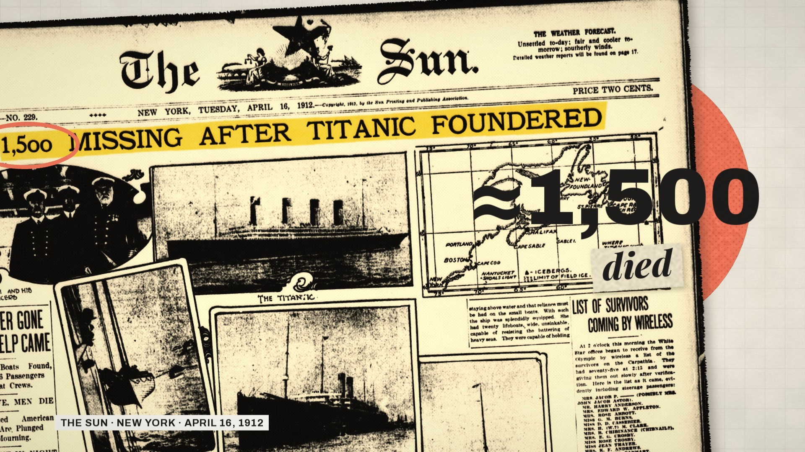
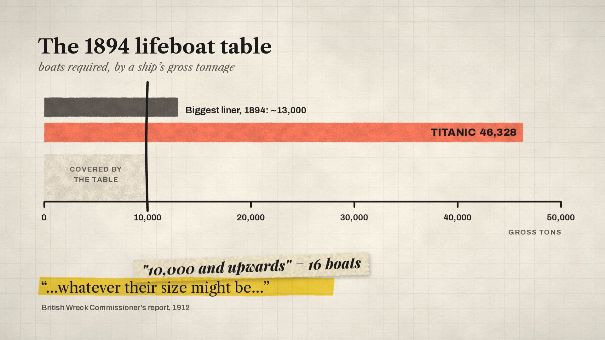
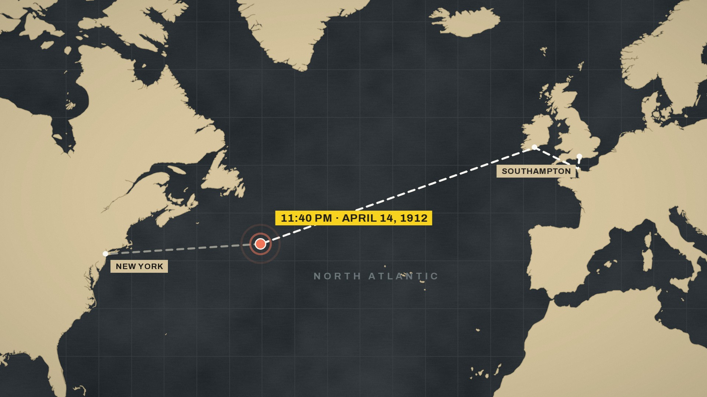

# STYLE — "Twenty Boats" / "Dvacet člunů"

## What the reference is

The reference link (`cz.pinterest.com/ideas/vox-animation/…`) is a Pinterest
**board of stills**, not a video. Of the 174 images on the page, about 20 are frames from
Vox-style explainers (collage title cards, a chart, two maps, cut-out compositions). The
rest are unrelated fan art of a cartoon character who happens to be called "Vox", and I
ignored those.

Because there is no footage, shot length, words per minute, loudness, music and sound
can't be measured from the reference. For those, this film follows the default notes in
the brief (marked *default* below) and the figures measured on our own cut. Everything
visual below comes from the reference frames. Nothing from them (images, logos,
lettering, channel name) is reused.

## Palette

Measured with k-means on the reference frames, then tightened to five working colours
plus two for maps and one for flood water.

| Role | Hex | Where it comes from in the reference |
|---|---|---|
| Paper (background) | `#F2ECDF` | cream graph-paper grounds, measured `#F7EBDB` / `#FAF7E6` / `#E7DFD6` |
| Paper, darker (cards, shaded areas) | `#E4DBCA` | torn-paper strips under labels |
| Grid lines | `#D4CBBA` at ~40 % | faint graph-paper grid behind charts and titles |
| Ink (type, lines) | `#1E1C1B` | near-black text, measured `#1C1A1B` / `#201D1C` |
| **Signature yellow** (highlighter, tape, date chips) | `#F7D21E` | highlighted headline words, yellow tape, yellow sun disc (`#F9DA0B`) |
| **Accent coral** (circles, markers, the key bar) | `#F2765A` | coral discs behind cut-outs, coral map country (`#F98870`, `#FB896C`) |
| Secondary blue (only for the "other side" of a comparison) | `#4C6FD6` | blue disc for the judge, blue chart bars (`#4F7AE7`, `#6DABD2`) |
| Map sea / land (night map) | `#2C3236` / `#D6C59E` | the dark world map with beige land |
| Flood water (diagrams) | `#78A0C4` | — |

The reference uses both a coral and a blue, so I keep blue as a sparing second accent.
Yellow and coral carry the film.

## Type

All fonts are open-licence (SIL OFL), from the Google Fonts repository on GitHub. All
of them contain every Czech letter (ě š č ř ž ý á í é ů ú ň ť ď and capitals). Text is
rendered with headroom above the cap height, so accents on capitals (Ě, Š, Ů, Ž …) are
never cut off.

| Use | Font | Reference look |
|---|---|---|
| Headlines, big numbers, title | **Archivo** ExtraBold / Black | bold grotesk headlines ("Something Strange", "Person") |
| Labels, chips, axis text | Archivo SemiBold, tracked caps | small clean caption text |
| Document text, chart titles | **Libre Caslon Text** (+ italic) | serif chart heading with an italic word ("How the U.S. *economy* changed") |
| Emphasis words on paper strips | **Playfair Display** Bold Italic | heavy italic serif on a torn strip ("*Proud of*") |

## How text appears and moves

- Labels and numbers **pop in**: a quick scale of 55 % → 108 % → 100 % over about 0.4 s
  with a fade, each with a soft "pop" sound.
- Key words get a **yellow highlighter sweep**, left to right, in time with the spoken word.
  It's a multiply blend, so newspaper ink shows through, with a chisel-edged slanted start
  and end.
- Words can sit on **torn paper strips** (Playfair italic), slightly tilted.
- **Hand-drawn marks** in coral or ink draw themselves on with a marker squeak: loops around
  a number, underlines, curved arrows, crosses and ticks.
- Numbers **count up** to their value.

## Photos and documents

- **Rectangular archival photos and front pages** are shown as prints with a **torn white
  paper edge**, a soft drop shadow, a slight tilt (−4° to +4°) and a slow drift or push-in.
  This follows the reference's torn-edge photos and is the "white border" from the brief.
- **Objects** (ships, the iceberg) are **die-cut** along their outline, with no border, a
  soft shadow and a faint printed-dot texture. They often sit on a **flat coral or yellow
  disc**, as in the reference.
- Photos are graded to a warm black-and-white print with gentle contrast and a fine
  halftone texture. Colour is reserved for the graphics.

## Maps and charts

- **Maps:** flat vector shapes, no relief. The night map is dark sea `#2C3236` with beige
  land `#D6C59E` and a faint graticule (as in the reference's dark world map). Routes draw
  on as white dashes, markers pulse in coral, and labels are small flat chips. The camera
  zooms from the whole North Atlantic down to a few miles of sea.
- **Charts:** a graph-paper ground, a serif title with a smaller italic subtitle, and
  horizontal bars with a dry-brush texture and slightly rough edges (as in the reference's
  bar chart). Bars grow from zero. Seat counts are dot grids that fill one dot at a time.

## Transitions

- **Paper slides:** the next sheet slides over the last frame of the previous scene with
  a shadowed edge and a whoosh.
- **Moves across one canvas:** within a scene, the camera pans and pushes across a large
  sheet of paper while elements arrive. Layers sit at different depths for gentle
  parallax.
- **Cuts** on strong beats (a number landing, a stamp).

## Pacing *(default; can't be measured from stills)*

- A new visual idea every **3–4 seconds**, and every animation is cued to the actual
  spoken word in that language. In the finished cut there are 21 shots joined by paper
  slides, about 6.3 s each on average, and inside them 118 animated beats (pops,
  highlighter sweeps, drawn marks, counters), roughly one every 1.1 s.
- Narration (measured on our recordings): English **≈160 words/min**, Czech **≈143
  words/min**. Czech words are longer, so the Czech cut runs longer. It's timed to its own
  voice, and the script isn't trimmed.
- Short holds after reveals; the title card and end card are silent.

## Music and sound *(default)*

- An **original synthesized score**, curious and thoughtful: soft plucked marimba/piano
  ostinato, warm pads, a low pulse. It builds at the collision and the "too late" beat,
  then drops to almost nothing for the last line.
- Sound effects: paper rustles on slides, marker squeaks on drawn marks, soft pops on
  labels, a tick on counters, whooshes on transitions.
- Music sits clearly under the voice: measured, it runs a median 16 dB below the narration
  while he speaks. The final mix is normalised with two-pass loudnorm. Measured: **−15.9
  LUFS**, true peak −1.8 dBFS (English) and −1.9 dBFS (Czech).

## Narration tone

A calm, curious explainer voice, conversational and clear, never dramatic. It asks a
question, then explains *why*, with concrete numbers and comparisons. ElevenLabs
`eleven_v4`, voice "Christian", is the same voice in both languages.

## Mock-ups

These are rendered with the film's own code ([`look.py`](look.py), [`geo.py`](geo.py)):

| | |
|---|---|
|  | A 1912 front page as a torn print, with a yellow highlighter on the headline, a coral loop around "1,500", and the number card on a coral disc. |
|  | A chart on graph paper: where the 1894 table stops versus the Titanic's size, a torn strip label, and a highlighted quote. |
|  | The night map: a dashed route drawing on, a pulsing collision marker, a yellow date chip. |
